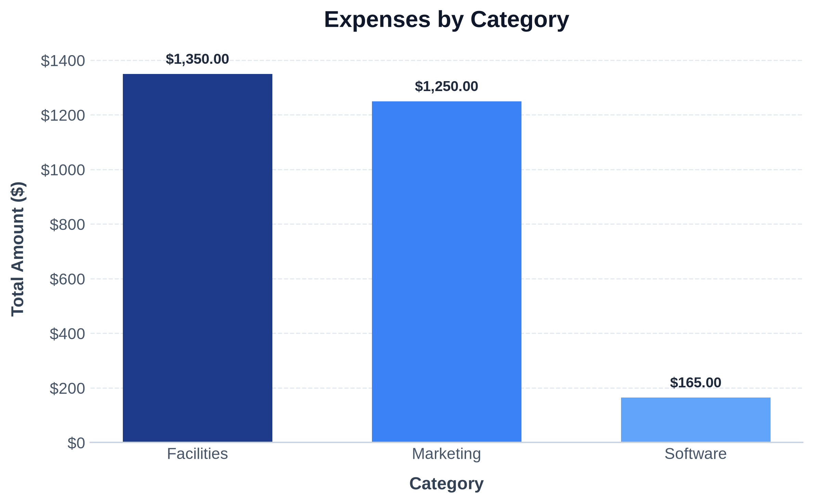

# Financial Summary

## Key Metrics
- **Total Income:** $5,700.00
- **Total Expenses:** $2,765.00
- **Net Cash Flow:** $2,935.00

## High-Expense Categories (>$1,000)
- **Facilities:** $1,350.00
- **Marketing:** $1,250.00

## Expense Breakdown by Category

